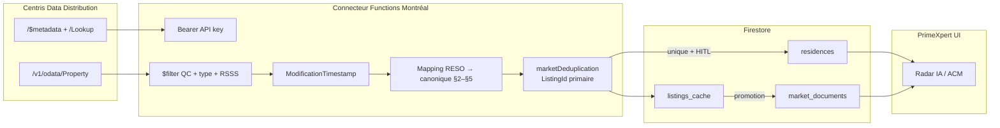

# Cartographie conceptuelle — Centris RESO (OData V4) → PrimeXpert V2

> **Statut :** brouillon de conception (été 2026) — **documentation seule**.  
> **Règle #0 :** enrichir les clés canoniques existantes ; ne pas dupliquer la logique métier hors `@primexpert/core`.  
> **Vérification :** conformité sémantique OACIQ / Loi 25 — aucun terme « audit » dans les libellés cibles.  
> **Portail source :** [Centris — Distribution de données (QC)](https://docs.datadistributionqc.centris.ca/fr/) — feuille de route infrastructure RESO/OData v4 (réf. doc. v2.8.0+).

---

## 1. Objectif

Préparer l’intégration de l’API Centris certifiée **RESO** (Real Estate Standards Organization, dictionnaire OData V4) en alignant chaque champ RESO sur les clés Firestore / view models déjà utilisés par PrimeXpert pour les **résidences RPA** au Québec, en s’appuyant sur la feuille de route officielle **Data Distribution QC**.

Références code existantes :

| Domaine | Emplacement SSOT |
|---------|------------------|
| Prix inscription | `buildListingPriceFirestorePatch()` — `src/services/residences.ts` |
| Statut pipeline | `resolveColumnId()`, `resolveResidenceStatus()` — `src/config/pipelineStages.ts` |
| Localisation | `residenceSearch.ts`, `quebecRegions.ts` — `packages/core/src/residence/` |
| Radar IA / signaux | `evaluateMarketOpportunityScoring()` — `packages/core/src/market/marketDeduplication.ts` |
| Anti-doublons marché | `marketDeduplication.ts`, empreintes comparables |
| Cache immuable inbound | `listings_cache` (normes d’implantation — voir §6, §8) |
| Feuille de route API Centris | [Getting Started OData](https://docs.datadistributionqc.centris.ca/getting-started) — authentification, requêtes, réplication incrémentale |

---

## 2. Bloc identification et prix

### 2.1 Correspondance sémantique

| Champ RESO (OData) | Type RESO | Clé canonique PrimeXpert | Miroirs Firestore (écriture groupée) | Notes |
|------------------|-----------|--------------------------|--------------------------------------|-------|
| `ListPrice` | Edm.Decimal | `prixDemande` | `price`, `prixAnnonce`, `askingPrice` | Prix affiché courant — SSOT métier pour Kanban / ACM |
| `OriginalListPrice` | Edm.Decimal | `prixOriginal` | `originalListPrice`, `prixListeInitial` (proposé) | Prix de lancement ; delta vs `ListPrice` = ajustement marché |

### 2.2 Structure JSON conceptuelle — prix

```json
{
  "resoInbound": {
    "ListPrice": { "sourceField": "ListPrice", "transform": "currencyCadInteger" },
    "OriginalListPrice": { "sourceField": "OriginalListPrice", "transform": "currencyCadInteger" }
  },
  "primexpertCanonical": {
    "prixDemande": { "from": "ListPrice", "required": true },
    "prixOriginal": { "from": "OriginalListPrice", "fallback": "ListPrice" }
  },
  "firestorePatch": {
    "strategy": "merge",
    "template": "buildListingPriceFirestorePatch(prixDemande)"
  }
}
```

**Règles de transformation :**

- Montants en **entiers CAD** (arrondi commercial), alignés sur `mapLegacyPrice()` / `buildListingPriceFirestorePatch`.
- Si `OriginalListPrice` absent : `prixOriginal` = `prixDemande` (pas d’invention de delta).

---

## 3. Bloc statut et timeline

### 3.1 RESO `StandardStatus` → machine Kanban

RESO (valeurs courantes MLS) :

| `StandardStatus` | Sémantique marché | `resolveColumnId()` → slug Firestore |
|------------------|-------------------|--------------------------------------|
| `Active` | Inscription active / visible | `mandate` |
| `Coming Soon` | Pré-mandat / à paraître | `prospect` |
| `Pending` | Sous promesse / condition | `promise` |
| `Closed` | Transaction conclue | `sold` |
| `Expired` | Mandat expiré | `expired` (hors Kanban chaud) |
| `Canceled` / `Withdrawn` | Retrait | `expired` ou `unsigned` selon politique agence |

### 3.2 Structure JSON conceptuelle — statuts

```json
{
  "resoStandardStatus": {
    "Active": "mandate",
    "Coming Soon": "prospect",
    "Pending": "promise",
    "Closed": "sold",
    "Expired": "expired",
    "Canceled": "expired",
    "Withdrawn": "unsigned"
  },
  "pipelineResolution": {
    "function": "resolveColumnId(rawStatut)",
    "persistField": "status",
    "legacyMirror": "statut",
    "dealStageRpa": {
      "note": "Orthogonal — dealStageMachine (analyse_financiere | due_diligence | cloture) reste sur promesseAchat / transaction, pas sur StandardStatus seul"
    }
  }
}
```

**Point d’intégration unique :** toute écriture RESO vers une fiche `residences/{id}` doit passer par **`resolveColumnId(StandardStatus)`** puis `buildPipelineStatusFirestorePatch(columnId)` — jamais de slug ad hoc dans l’UI.

---

## 4. Bloc emplacement (Loi 25)

### 4.1 Correspondance

| Champ RESO | Clé canonique | Fallback géographique Montréal / QC |
|------------|---------------|-------------------------------------|
| `StateOrProvince` | `region` / `regionAdministrative` | `QC` (normalisé) — jamais persister hors Canada sans consentement |
| `PostalCode` | `codePostal` (proposé) + miroir `postalCode` | Format `H#X #X#` ; validation regex québécoise |
| `City` | `ville` | Miroir `city` |
| `StreetNumber` + `StreetName` | `address` (composition) | Aligné `extractResidenceAddressAndCities()` |

### 4.2 Chiffrement / minimisation (conceptuel)

- **Stockage courtier (Firestore `residences`) :** texte clair pour exploitation métier (mandat, ACM) — cloisonné `orgId` / règles tenant.
- **Cache inbound immuable (`listings_cache`) :** conserver le payload RESO brut + empreinte ; champs sensibles (`PostalCode` complet) optionnellement **tronqués** (FSALDU-3) dans les vues agrégées Radar.
- **Région Functions :** ingestion RESO ciblée `northamerica-northeast1` lorsque le connecteur sera implémenté.

```json
{
  "location": {
    "StateOrProvince": { "to": "region", "normalize": "uppercase", "default": "QC" },
    "PostalCode": { "to": "codePostal", "validate": "caPostalQc", "displayFallback": "Montréal, QC" },
    "City": { "to": "ville", "mirror": "city" }
  }
}
```

---

## 5. Bloc descriptif et texte (Radar IA)

| Champ RESO | Destination PrimeXpert | Moteur |
|------------|------------------------|--------|
| `PublicRemarks` | Entrée texte pour scoring opportunité | `evaluateMarketOpportunityScoring()` + enrichissement futur NLP sur `PublicRemarks` |
| `PrivateRemarks` | **Non exposé** UI acheteur — stockage broker-only | Filtrage tenant strict |

**Flux conceptuel :**

1. `PublicRemarks` → champ staging `remarksPublic` sur document `listings_cache`.
2. Lors de la promotion vers `residences` ou `market_documents`, extraire signaux faibles (occupation, certification, urgence vendeur) via le même pipeline que `summaryOneLine` courriel.
3. Injecter `iaOpportunityScoring` sur `market_documents` (déjà en prod Phase 2) — **HITL obligatoire** avant action commerciale automatisée.

```json
{
  "PublicRemarks": {
    "staging": "listings_cache.remarksPublic",
    "ai": {
      "engine": "evaluateMarketOpportunityScoring",
      "inputs": ["remarksPublic", "regionAdministrative", "assetClassLabel"],
      "output": "iaOpportunityScoring",
      "hitl": true
    }
  }
}
```

---

## 6. Architecture inbound fail-safe (schéma conceptuel)

> Détail des requêtes OData et du modèle de cache : **§7** et **§8**.

```
┌─────────────────┐     ┌──────────────────────┐     ┌─────────────────────────┐
│ API Centris     │     │ Connecteur RESO      │     │ listings_cache          │
│ RESO OData V4   │────▶│ (Functions Montréal) │────▶│ (immuable, horodaté)    │
└─────────────────┘     └──────────────────────┘     └───────────┬─────────────┘
                                                                 │
                    ┌────────────────────────────────────────────┘
                    ▼
         ┌──────────────────────┐     ┌──────────────────────────┐
         │ marketDeduplication    │     │ Fingerprint / comparable │
         │ normalize + dedupe     │────▶│ status: unique | duplicate│
         └──────────┬───────────┘     └──────────────────────────┘
                    │ unique seulement
                    ▼
         ┌──────────────────────┐     ┌──────────────────────────┐
         │ Mapping canonique    │────▶│ residences/{id}          │
         │ (§2–§4)              │     │ + market_documents       │
         └──────────────────────┘     └───────────┬──────────────┘
                                                  │
                                                  ▼
                                       ┌──────────────────────────┐
                                       │ UI (Kanban, Radar, ACM)  │
                                       │ lecture seule SSOT       │
                                       └──────────────────────────┘
```

**Garanties fail-safe :**

| Étape | Comportement |
|-------|----------------|
| Échec API RESO | Dernière version `listings_cache` conservée ; pas d’écrasement `residences` |
| Doublon détecté | `userAction: 'skip'` par défaut — pas de fiche dupliquée |
| Mapping invalide | Ligne rejetée + log conformité ; fiche courtier inchangée |
| IA indisponible | `PublicRemarks` stocké brut ; scoring différé |

---

## 7. Architecture des requêtes (endpoint OData Centris)

### 7.1 Principes d’accès direct

Le portail **Data Distribution QC** expose une API REST **OData v4** sous la base :

`https://datadistributionqc.centris.ca/v1/odata/`

| Élément | Spécification Centris | Usage PrimeXpert (conceptuel) |
|---------|----------------------|-------------------------------|
| Authentification | En-tête `Authorization: Bearer {api_key}` | Secret Functions `CENTRIS_DATA_API_KEY` (sprint implémentation) |
| Métadonnées | `GET /$metadata` | Génération du mapping RESO ↔ canonique ; **analyse de conformité de l’API** avant promotion |
| Entité principale inscriptions | `Property` | Source des fiches RPA / commerciales |
| Clé OData | `ListingKey` (identifiant technique unique) | Clé de document secondaire ; navigation `Property('…')` |
| Numéro d’inscription Centris | `ListingId` (affiché sur Centris.ca) | **Jeton de déduplication principal** (§8) |
| Synchronisation incrémentale | `ModificationTimestamp` | Curseur par ressource ; ne jamais repartir de zéro après erreur 429/5xx |

**Requêtage direct (sans duplication de connecteur)** : le futur job d’ingestion interroge `Property` avec `$select`, `$filter`, `$orderby`, `$top` / `@odata.nextLink`, conformément au [guide Getting Started](https://docs.datadistributionqc.centris.ca/getting-started).

Exemple canonique (inscriptions actives, champs minimaux) :

```http
GET /v1/odata/Property?$select=ListingKey,ListingId,ListPrice,StandardStatus,StateOrProvince,PostalCode,ModificationTimestamp
    &$filter=StateOrProvince eq 'QC' and StandardStatus eq 'Active'
    &$orderby=ModificationTimestamp asc
    &$count=true
Authorization: Bearer {api_key}
```

Réplication incrémentale (recommandation officielle Centris) :

```http
GET /v1/odata/Property?$select=ListingKey,ListingId,ModificationTimestamp
    &$filter=ModificationTimestamp gt {dernierHorodatagePersisté}
    &$orderby=ModificationTimestamp asc
```

Réconciliation globale (table `Lookup`) :

```http
GET /v1/odata/Lookup?$select=LookupKey,ModificationTimestamp
```

> **Webhooks :** optionnels selon la FAQ Centris ; la réplication par **pull + réconciliation** reste obligatoire (résilience supérieure).

### 7.2 Filtrage — propriétés commerciales et RPA (Québec)

Les types et sous-types sont des **Lookup** RESO (valeurs configurables par agence). Le connecteur ne codera pas de libellés en dur : il résoudra les clés via `/Lookup?$expand=Translations` puis appliquera `$filter` sur `PropertyType` / `PropertySubType` (et champs dérivés `CurrentOrPossibleUse`, `UnitCurrentUse` via `$expand=Units` pour immeubles à revenus).

| Cible métier PrimeXpert | Filtre OData conceptuel | Notes |
|-------------------------|-------------------------|-------|
| Québec seulement | `StateOrProvince eq 'QC'` | Aligné §4 — Loi 25 |
| Inscriptions commerciales | `PropertyType eq '{CommercialSale}'` **or** `PropertyType eq '{CommercialLease}'` | Valeurs `{…}` = clés Lookup Centris |
| Immeubles à revenus / RPA | `PropertySubType` ∈ ensemble `{IncomeProperty, MultiFamily, …}` **or** `Units/any(u: u/UnitCurrentUse eq 'Commercial')` | Validation humaine si ambiguïté résidentiel vs RPA |
| Exclusion résidentiel pur | `not (PropertyType eq '{Residential}')` | À affiner selon métadonnées `$metadata` du compte courtier |

Requête combinée (esquisse) :

```http
GET /v1/odata/Property?$select=ListingKey,ListingId,PropertyType,PropertySubType,ListPrice,PublicRemarks
    &$filter=StateOrProvince eq 'QC'
        and (PropertyType eq '{CommercialSale}' or PropertyType eq '{CommercialLease}' or PropertySubType eq '{IncomeProperty}')
        and StandardStatus eq 'Active'
    &$expand=Units($select=UnitCurrentUse,UnitMonthlyGrossIncome),Translations
```

### 7.3 Filtrage par région administrative socio-sanitaire (RSSS)

Centris expose des référentiels géographiques hiérarchiques (`StateRegion`, `CityOrTownship`, `Neighborhoods`) avec traductions FR/EN — voir exemples portail :

```http
GET /v1/odata/StateRegion?$expand=Translations
GET /v1/odata/CityOrTownship?$expand=Neighborhoods(expand=Translations)
```

**Modèle conceptuel de passage des paramètres RSSS :**

```
┌──────────────────────┐     ┌─────────────────────────────┐     ┌──────────────────────────┐
│ UI / job ingestion   │     │ Paramètres filtre RSSS      │     │ Requête OData Property   │
│ selectedRegions[]    │────▶│ map RSSS → StateRegion keys │────▶│ $filter=…/CityOrTownship │
│ (QUEBEC_REGIONS SSOT)│     │ + code postal optionnel     │     │ + PostalCode startswith    │
└──────────────────────┘     └─────────────────────────────┘     └──────────────────────────┘
         │                              │
         │                              ▼
         │                    resolveResidenceQuebecRegion()  (packages/core)
         │                    residenceMatchesRegionFilter()    (post-ingestion locale)
         ▼
   Ex. : ['Montréal','Montérégie']  →  StateRegionKey IN (…)  OR  PostalCode ge 'H'/'J'
```

| Entrée courtier | Transformation | Champ RESO / Centris |
|-----------------|----------------|----------------------|
| `selectedRegions: QuebecRegion[]` | Table de correspondance `QUEBEC_REGIONS` → clés `StateRegion` Centris | Filtre sur navigation géographique ou agrégat `CityOrTownship` |
| Filtre fin (arrondissement) | Extension `Neighborhoods` | `$expand` + filtre secondaire côté connecteur |
| Repli Montréal | Si région non résolue | `PostalCode` préfixe `H` + `City` contenant « Montréal » (§4) |

**Règle d’or :** le filtre OData **réduit le volume API** ; `residenceMatchesRegionFilter()` dans `@primexpert/core` reste le garde-fou applicatif sur les documents déjà en `listings_cache` / `residences`.

### 7.4 Opérateurs OData supportés (rappel)

| Opérateur | Usage typique PrimeXpert |
|-----------|-------------------------|
| `$select` | Projection minimale (`ListingKey`, `ModificationTimestamp`) pour curseur |
| `$filter` | QC, statut, type, horodatage, région |
| `$orderby` | `ModificationTimestamp asc` (file incrémentale) |
| `$expand` | `Media`, `Units`, `Translations`, `ListAgent` |
| `$top` / `@odata.nextLink` | Pagination ; respect quotas (429 → reprise au dernier curseur) |
| `$count` | Volumétrie pour tableaux de bord ingestion |

---

## 8. Alignement des payloads JSON sur l’existant

### 8.1 Intégration incrémentale dans `listings_cache`

**Confirmation d’architecture :** tout flux Centris OData alimente d’abord la collection Firestore **`listings_cache`** déjà prévue dans les normes d’implantation (extractions Centris/Matrix, pipeline PDF `processCentrisPDF` → même destination). Aucune collection parallèle.

| Principe | Comportement |
|----------|--------------|
| Écriture | `merge: true` sur document existant ; append-only des snapshots (`receivedAt`, `payloadVersion`) |
| Immuabilité | Le JSON RESO brut (`resoPayload`) n’est jamais écrasé sans historique ; dernière vue dénormalisée dans `canonicalPreview` |
| Promotion | Vers `residences` / `market_documents` uniquement après déduplication + HITL (§6) |
| Échec mapping | Ligne conservée dans `listings_cache` avec `ingestStatus: 'rejected'` ; fiche courtier inchangée |

Structure conceptuelle d’un document `listings_cache/{docId}` :

```json
{
  "source": "centris_odata",
  "centrisListingId": "12345678",
  "centrisListingKey": "14689588",
  "orgId": "{tenant}",
  "receivedAt": "2026-05-28T16:00:00.000Z",
  "modificationTimestamp": "2026-05-28T15:42:11.000Z",
  "resoPayload": { },
  "canonicalPreview": {
    "prixDemande": 8500000,
    "prixOriginal": 8990000,
    "regionAdministrative": "Montréal",
    "remarksPublic": "…"
  },
  "ingestStatus": "staged",
  "dedupe": {
    "primaryToken": "centris:12345678",
    "fingerprint": "centris__inscription__12345678"
  }
}
```

**Identifiant Firestore proposé :** `ensureFirestoreDocId('centris__inscription__' + ListingId)` — réutilise `ensureFirestoreDocId()` de `marketDeduplication.ts` sans nouvelle fonction parallèle.

### 8.2 Déduplication — numéro d’inscription Centris → `marketDeduplication.ts`

| Jeton | Champ RESO/Centris | Rôle dans l’algorithme existant |
|-------|-------------------|--------------------------------|
| **Principal** | `ListingId` (numéro d’inscription public) | Clé métier unique par inscription ; `_dedupe.status` sur import cache |
| **Secondaire** | `ListingKey` | Clé OData ; navigation API ; secours si `ListingId` absent |
| **Tertiaire (comparables sans Centris)** | empreinte `marketTransactionFingerprint()` | Adresse + date + prix (logique actuelle § ventes comparables) |

Extension conceptuelle (sprint implémentation — **un seul module** `marketDeduplication.ts`) :

```json
{
  "centrisListingDedupe": {
    "primaryField": "ListingId",
    "docIdPattern": "centris__inscription__{ListingId}",
    "onDuplicate": {
      "status": "duplicate",
      "userAction": "skip",
      "compareField": "ModificationTimestamp",
      "keepNewer": true
    },
    "fallback": {
      "whenMissingListingId": "ListingKey",
      "whenMissingBoth": "marketTransactionFingerprint"
    }
  }
}
```

Flux de décision :

1. Si `ListingId` présent → recherche document `listings_cache` / comparables par `centrisListingId`.
2. Si doublon et `ModificationTimestamp` plus récent → mise à jour incrémentale du même doc (pas de nouvelle fiche).
3. Si pas d’identifiant Centris (import CSV legacy) → `findDuplicateSaleMatch()` / `attachDedupeMetadata()` inchangés.

### 8.3 Workflow d’ingestion API → base de données (esquisse)



**Étapes numérotées :**

1. **Analyse de conformité de l’API** — lecture `$metadata`, validation des Lookup `PropertyType` du compte.
2. **Pull incrémental** — `Property` filtré (`QC`, types commerciaux/RPA, curseur `ModificationTimestamp`).
3. **Staging** — écriture merge dans `listings_cache` + `resoPayload` complet.
4. **Déduplication** — `ListingId` → statut `unique` | `duplicate` via extension de `marketDeduplication.ts`.
5. **Mapping canonique** — `prixDemande`, `resolveColumnId(StandardStatus)`, localisation (§4), `PublicRemarks` (§5).
6. **Promotion optionnelle** — `residences` / `market_documents` après validation humaine.
7. **Présentation** — Kanban, Radar, ACM (lecture SSOT).

---

## 9. Prochaines étapes (hors ce document)

1. Module `@primexpert/core/market/centrisResoMapper.ts` (implémentation — sprint suivant).
2. Callable `ingestResoListingSnapshot` → écriture `listings_cache` uniquement.
3. Job de promotion manuelle ou semi-auto vers `residences` avec HITL.
4. Tests de non-régression sur `resolveColumnId` avec jeu de statuts RESO réels.
5. Table de correspondance `StateRegion` Centris ↔ `QUEBEC_REGIONS` (fichier config unique).
6. Secret `CENTRIS_DATA_API_KEY` + quotas / backoff 429 selon FAQ portail.

---

*Document créé : 2026-05-28 — enrichi : 2026-05-28 (feuille de route Centris Data Distribution QC). Conception uniquement, aucun fichier `.ts` modifié par ce livrable.*
