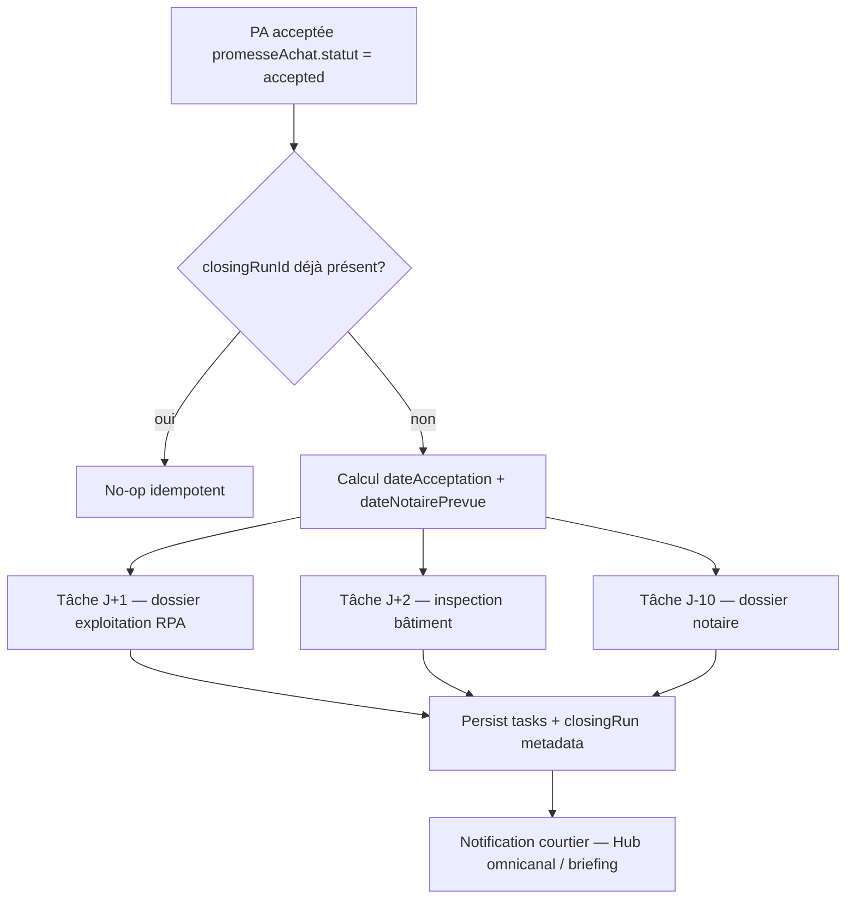

# Cadre de conception — Après-vente, fermeture et conformité Loi 25 (V2.7)

> **Statut :** brouillon d’ingénierie (lancement septembre 2026) — **documentation seule**.  
> **Règle #0 :** enrichir `organizations/{orgId}/contacts`, `residences/{id}/tasks`, `promesseAchat` / `offre` — aucune collection parallèle.  
> **Validation :** conformité légale et déontologique — vocabulaire « validation d’adéquation de conformité légale » (jamais le terme banni « audit »).

**Références SSOT existantes :**

| Domaine | Emplacement |
|---------|-------------|
| Promesse d’achat & délais | `packages/core/src/transaction/promesseAchatEngine.ts` |
| Pipeline Kanban | `src/config/pipelineStages.ts` — colonne `promise`, statut PA `accepted` |
| Tâches résidence | `residences/{residenceId}/tasks` — `dueAtMillis`, `status: 'a_faire'` |
| Contacts CRM | `packages/core/src/crm/contactTypes.ts` — `OrganizationContact`, `ContactCommunicationPreferences` |
| Messagerie omnicanale | `functions/src/messaging/ingestOmnichannelMessage.ts` |
| Rétention OACIQ (6 ans) | `promesseAchatEngine` — `WORM_LOCK_MESSAGE_*`, charte gouvernance |

---

## 1. Pipeline de closing — `onPromiseAcceptedTrigger`

### 1.1 Déclencheur conceptuel

| Élément | Spécification |
|---------|---------------|
| **Nom fonction (sprint implémentation)** | `onPromiseAcceptedTrigger` |
| **Région cible** | `northamerica-northeast1` (Montréal) |
| **Événement** | Transition documentaire `residences/{residenceId}` lorsque `promesseAchat.statut` passe à **`accepted`** (équivalent métier `promise_accepted`) **et** `prixAccepte` / `offre` validés (garde-fou existant `validatePipelineColumnMove`) |
| **Idempotence** | Clé `closingRunId` = hash(`residenceId` + `promesseAchat.dateAcceptation`) — une seule génération de pack de tâches par acceptation |
| **Sortie** | Écriture batch dans `residences/{residenceId}/tasks` + journal de conformité (voir §4) |

### 1.2 Machine à états (alignement existant)

```
Kanban status: promise
       │
       ▼
promesseAchat.statut: accepted  ──►  onPromiseAcceptedTrigger
       │
       ├── dealStageRpa: due_diligence (orthogonal, manuel ou auto-suggestion)
       └── tasks[] générées (J+1, J+2, J-10 clôture)
```

> **Note :** le slug pipeline Firestore reste `promise` ; l’état métier « promesse acceptée » est porté par `promesseAchat.statut === 'accepted'`, pas par un nouveau slug Kanban.

### 1.3 Enchaînement des tâches automatiques

Horloge de référence : **`promesseAchat.dateAcceptation`** (ISO `YYYY-MM-DD`, fuseau `America/Toronto`).  
Calcul des échéances : réutiliser `addCalendarDays()` de `promesseAchatEngine.ts`.

| # | Délai | Titre (FR) | Description opérationnelle | `dueAtMillis` | Liens métier |
|---|-------|------------|---------------------------|---------------|--------------|
| **1** | **J+1** | Acheminement dossier d’exploitation RPA | Transmettre au courtier hypothécaire : baux en vigueur, états financiers, rapports CISSS / conformité exploitation, liste locataires | `dateAcceptation + 1j` 09:00 EST | `partiesImpliquees` rôle `MORTGAGE_BROKER` ; docs `residences/{id}/documents` catégorie financier / légal |
| **2** | **J+2** | Suivi levée — condition inspection bâtiment | Vérifier date limite inspection (`promesseAchat.delais.inspectionJours` → `dateLimiteInspection`) ; relance vendeur / inspecteur | `dateAcceptation + 2j` 09:00 EST | `offre.conditions` + délais calculés par moteur PA |
| **3** | **J−10 avant clôture** | Dossier complet au notaire instrumentant | Préparer et envoyer le dossier d’achat (titres, PA acceptée, déclarations, hypothèque) | `dateNotairePrevue − 10j` 09:00 EST | `promesseAchat.dateNotairePrevue` ; contact typologie `notaire` |

**Schéma document Firestore `residences/{id}/tasks/{taskId}` (extension closing) :**

```json
{
  "title": "Acheminement dossier d'exploitation RPA — hypothèque",
  "description": "…",
  "status": "a_faire",
  "dueAtMillis": 1735689600000,
  "authorId": "{brokerId}",
  "source": "closing_pipeline",
  "closingPackId": "{closingRunId}",
  "closingTaskCode": "CLOSING_RPA_DOSSIER_HYPOTHEQUE",
  "priority": "high",
  "createdAtMillis": 1735603200000
}
```

### 1.4 Diagramme de flux



### 1.5 Règles fail-safe

| Cas | Comportement |
|-----|--------------|
| `dateAcceptation` absente | Reporter génération ; alerte courtier (pas de tâches fantômes) |
| `dateNotairePrevue` absente | Tâche 3 créée avec `dueAtMillis` = J+30 provisoire + flag `requiresManualDate` |
| Régression statut PA | Ne pas supprimer les tâches passées ; marquer pack `superseded` si nouvelle acceptation |
| Multi-tenant | Filtrer `orgId` sur `residences` avant toute écriture |

---

## 2. Extension Loi 25 — consentements (`QuebecLaw25Consent`)

### 2.1 Principe

Enrichir **`OrganizationContact`** via le bloc existant **`communicationPreferences`** (`ContactCommunicationPreferences`) — **pas** de sous-collection `consents/`.

Les champs `unsubscribedFromEmails` / `excludedFromMassMailing` restent la source de vérité pour les **exclusions** ; `law25Consent` porte la **preuve affirmative** (opt-in) exigée pour SMS et courriel marketing / nurturing RPA.

### 2.2 Interface canonique (Core — sprint implémentation)

```typescript
export interface QuebecLaw25Consent {
  smsOptIn: boolean;
  emailOptIn: boolean;
  consentGrantedTimestamp: number;
  collectedFromIpAddress: string;
  /** Ex. RpaEvaluationRequestForm, VendorPortalSignup, AcmDownloadGate */
  consentSourceForm: string;
  /** Alignement conservation dossier courtage OACIQ — 6 ans à partir du consentement ou clôture */
  dataRetentionExpiryTimestamp: number;
}
```

### 2.3 Modèle JSON conceptuel — contact enrichi

```json
{
  "organizations": {
    "{orgId}": {
      "contacts": {
        "{contactId}": {
          "nom": "…",
          "orgId": "{orgId}",
          "ownerId": "{brokerId}",
          "communicationPreferences": {
            "unsubscribedFromEmails": false,
            "excludedFromMassMailing": false,
            "law25Consent": {
              "smsOptIn": true,
              "emailOptIn": true,
              "consentGrantedTimestamp": 1735689600000,
              "collectedFromIpAddress": "203.0.113.42",
              "consentSourceForm": "RpaEvaluationRequestForm",
              "dataRetentionExpiryTimestamp": 1924992000000
            }
          }
        }
      }
    }
  }
}
```

**Calcul recommandé `dataRetentionExpiryTimestamp` :**

```
consentGrantedTimestamp + (6 × 365.25 × 24 × 60 × 60 × 1000)
```

Ou, si transaction clôturée : `max(consentGranted, promesseAchat.wormLockedAt) + 6 ans`.

### 2.4 Matrice d’usage omnicanal

| Canal | Condition d’envoi | Vérification |
|-------|-------------------|--------------|
| SMS Twilio | `law25Consent.smsOptIn === true` | `ingestOmnichannelMessage` / webhook sortant |
| Courriel Nylas (marketing) | `emailOptIn === true` **et** `!unsubscribedFromEmails` | `nylasSendMessage` |
| Courriel transactionnel (PA, notaire) | Consentement implicite contrat — journaliser `consentSourceForm: TransactionalPA` | Hors campagne masse |

### 2.5 Validation d’adéquation de conformité légale (processus)

| Contrôle | Description |
|----------|-------------|
| Preuve IP + horodatage | Obligatoire à la collecte web / portail vendeur |
| Révocation | Mise à jour `smsOptIn` / `emailOptIn` à `false` + `consentRevokedTimestamp` (champ futur) |
| Export personnes concernées | Inclure `law25Consent` dans export dossier contact (ZIP dossier — phase ultérieure) |
| Expiration | Job planifié `purgeExpiredContactMarketingData` (après `dataRetentionExpiryTimestamp`) — **HITL** avant suppression définitive |

---

## 3. Gestion géographique Firebase — souveraineté Québec

### 3.1 Objectif V2.7

Forcer l’**ancrage régional** des données sensibles RPA (santé CISSS, finances, baux) et des traitements courtier sur **`northamerica-northeast1`** (Montréal).

### 3.2 État actuel vs cible (primexpert-app-v2)

| Ressource | Région actuelle (prod) | Cible V2.7 | Notes migration |
|-----------|------------------------|------------|-----------------|
| Cloud Functions — messagerie (`twilioSmsWebhook`, `metaMessagingWebhook`) | `northamerica-northeast1` | **Maintenir** | Conforme |
| Cloud Functions — callable majorité | `us-central1` (défaut `FUNCTION_REGION`) | **Migrer** vers `northeast1` par lot | Redéploiement sans changement de code métier |
| Cloud Functions — `onVoiceNoteUploaded` | `us-east1` | **Exception documentée** | Bucket Storage Firebase `*.firebasestorage.app` — contrainte Google |
| Vertex Gemini (parse, voix, négociation) | `us-central1` | **Exception technique** | Publisher models ; minimiser payload PII dans prompts |
| Firestore | Multi-région / `nam5` (selon console) | **Vérifier console** — documenter emplacement primaire Canada si disponible | Pas de déplacement rétroactif sans migration planifiée |
| Cloud Storage — documents courtier | Règles `primexpert/{brokerId}/…` | **Bucket régional `northamerica-northeast1`** pour nouveaux préfixes `closing/` et `law25/` | Anciens objets : lifecycle copy progressif |

### 3.3 Configuration obligatoire (checklist ops)

1. **Console Firebase** → Paramètres projet → Emplacement par défaut des ressources : privilégier **Canada** lorsque proposé pour nouveaux buckets.
2. **Nouvelles Cloud Functions** closing / Loi 25 : déclarer explicitement  
   `region: 'northamerica-northeast1'` dans `functions/src/index.ts` (même pattern que webhooks SMS).
3. **Variables d’environnement** : `FUNCTION_REGION=northamerica-northeast1` pour les callables Montréal ; ne pas globaliser sans revue des dépendances Vertex.
4. **Secret Manager** : répliquer les secrets utilisés par les fonctions Montréal dans la même région lorsque requis par GCP.
5. **Validation d’adéquation de conformité légale** : documenter dans le registre des traitements (EFVP) la liste des exceptions `us-central1` / `us-east1` et les mesures de minimisation (anonymisation, pas de CISSS brut dans prompts IA).

### 3.4 Schéma de cloisonnement régional (conceptuel)

```
┌─────────────────────────────────────────────────────────────┐
│  northamerica-northeast1 (Montréal) — PRIMAIRE V2.7         │
│  • onPromiseAcceptedTrigger                                 │
│  • ingestOmnichannel / SMS / Meta                           │
│  • Stockage closing + preuves Loi 25 (nouveaux préfixes)    │
└─────────────────────────────────────────────────────────────┘
         │
         │  exceptions contraintes Google
         ▼
┌──────────────────────┐    ┌──────────────────────┐
│ us-east1             │    │ us-central1          │
│ Storage voice_notes  │    │ Vertex Gemini STT/IA │
│ (bucket Firebase)    │    │ (publisher models)   │
└──────────────────────┘    └──────────────────────┘
```

---

## 4. Rétention — 5 ans programme / 6 ans OACIQ

| Horizon | Portée | Mécanisme existant / prévu |
|---------|--------|----------------------------|
| **6 ans** | Dossiers courtage, PA acceptée, preuves consentement | `promesseAchat.wormLockedAt` ; `dataRetentionExpiryTimestamp` ; coffre documents |
| **5 ans** | Indicateur produit « rétention active » tableau de bord courtier | Métrique dérivée — ne pas raccourcir sous le minimum OACIQ 6 ans pour les pièces réglementaires |

---

## 5. Prochaines étapes (hors ce document)

1. Implémenter `QuebecLaw25Consent` dans `contactTypes.ts` + formulaires portail / ACM.
2. Callable ou trigger `onPromiseAcceptedTrigger` → génération tâches §1.3.
3. Middleware sortant SMS/courriel — refus si consentement absent.
4. Plan de migration régionale Functions (lot par lot) + registre EFVP mis à jour.
5. Tests idempotence `closingRunId` sur `residences/{id}/tasks`.

---

*Document créé : 2026-05-28 — conception V2.7 uniquement, aucun fichier `.ts` ni `firestore.rules` modifié par ce livrable.*
