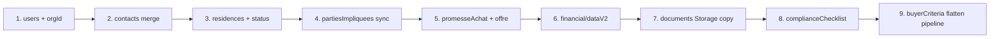

# Cartographie Firebase — Legacy (Copilote-RPA) vs V2 (PrimeXpert)

> **Statut :** plan de migration validé PO (Alain) — diagnostic uniquement, **aucun script de migration final** dans ce document.  
> **Sources disque :**  
> - Legacy : `/Volumes/SAUVEGARDE GRIS/00_RPA_SYSTEME_APP/Copilote-RPA`  
> - V2 : `/Volumes/SAUVEGARDE GRIS/01_PRIMEXPERT_SYSTEME_APP_STABLE_V2`  
> **Date validation :** 2026-05-20

---

## Principes directeurs V2

| Règle | Legacy | V2 |
|--------|--------|-----|
| Contacts CRM | `contacts/` + `vendors/` (pas de `clients/`) | **`organizations/{orgId}/contacts/{contactId}`** (SSOT unique) |
| Pipeline acheteur | `buyerPipeline/{docId}` | **Interdit** → champs sur le contact (`buyerQualificationStatus`, `buyerCriteria`) |
| Pipeline vendeur | `residences.status` / `statut` | `residences.status` (enum canonique) |
| Promesses | `purchaseOffers/` + miroir `purchaseOffer/current` | `residences.promesseAchat` + `offre` (objets racine) |
| Cloisonnement | `brokerId` / `courtierResponsable` | Contacts **org-scoped** ; résidences **broker-scoped** (`courtiersResponsables`) |

**Règle #0 :** enrichir l'existant, zéro duplication de collections parallèles.

---

## 1. Contacts (vendeurs / acheteurs)

### 1.1 Collections Legacy → cible V2

| Collection Legacy | Rôle | Cible V2 | Statut import |
|-------------------|------|----------|---------------|
| `contacts/{id}` | Acheteurs, vendeurs, leads | `organizations/{orgId}/contacts/{id}` | `legacyContactImport.ts` + script existant |
| `vendors/{id}` | CRM vendeurs (≠ portail) | **Fusion** dans le même contact (dédoublonnage email/téléphone) | Idem |
| `clients/` | — | **N'existe pas** en Legacy | N/A |
| `users/{uid}` | Auth + `contactId`, `residenceIds`, `role: buyer\|vendor` | `users/{uid}` V2 (profil SaaS) + lien via `contactId` | Migration séparée (auth) |
| `buyerPipeline/{docId}` | Kanban acheteur | **Ne pas recréer** → voir §3 | À aplatir sur contact |

### 1.2 Mapping champs — identité & CRM

| Champ Legacy (`contacts` / `vendors`) | Champ V2 (`OrganizationContact`) | Notes |
|--------------------------------------|------------------------------------|-------|
| `prenom`, `firstName` | `prenom` | |
| `nom`, `lastName`, `displayName`, `companyName` | `nom` | Fusion si merge |
| `courriel`, `email` | `email` | Clé dédoublonnage |
| `telephone`, `cellulaire`, `phone`, `mobile` | `telephone` | Normalisation 10 chiffres |
| `adresse`, `address` | `adresse.ligne1` | LCI obligatoire |
| `ville`, `city` | `adresse.ville` | Placeholder si manquant |
| `codePostal`, `postalCode` | `adresse.codePostal` | |
| `dateNaissance`, `dateOfBirth` | `dateNaissance` | Placeholder `0000-00-00` + `importMeta.lciIncomplete` |
| `occupation`, `profession`, `title` | `occupationProfession` | |
| `type`, `roles[]`, `crmIntentRole` | `relationRoles[]` | `acheteur/buyer`→`buyer`, `vendeur/vendor`→`seller` |
| `residenceIds[]` | `residenceIds[]` | Union au merge ; sync avec `partiesImpliquees` |
| `notes` | `notes` | |
| `courtierResponsable` | `ownerId` | UID courtier propriétaire |
| `provenance`, `source` | `leadSource` | `IMPORT_LEGACY` à l'import |
| `createdAt`, `updatedAt` | `createdAt`, `updatedAt` | ISO string V2 |
| — | `orgId`, `silo`, `assetNiche`, `visibility` | Défaut import : `COMMERCIAL_SPEC`, `RPA`, `AGENCY_SHARED` |
| — | `importMeta.legacySources[]` | Traçabilité obligatoire |

### 1.3 Mapping — acheteur (critères & qualification)

| Champ Legacy | Champ V2 | Trou ? |
|--------------|----------|--------|
| `regionPreferee`, `region`, `regionsRecherchees` | `buyerCriteria.regions[]` | |
| `budgetMax`, `budget` | `buyerCriteria.budgetMax` | |
| `nombreUnitesMin/Max`, `unitesMin/Max` | `buyerCriteria.unitsMin/Max` | |
| `typeResidenceSouhaitee`, `typesDeResidence` | `buyerCriteria.residenceTypes[]` | |
| `miseDeFonds`, `downPayment` | `buyerCriteria.downpaymentAmount` | |
| `etapeDemarches`, `dureeRecherche` | `buyerCriteria.timeline` | Mapping manuel vers enum V2 |
| `travailleAvecCourtier` | `buyerCriteria.hasBroker` | |
| `experienceSante`, `autresRpaInteressantes` | `buyerCriteria.experienceDescription` | Fusion textuelle |
| `confidentialityAgreementUrl`, docs NDA | `buyerCriteria.ndaFile` | `{ url, storagePath, uploadedAt }` |
| `proofOfFundsUrl` | `buyerCriteria.proofOfFundsFile` | |
| `ndaSigned`, `hasNDASigned` | `buyerQualificationStatus: NDA_SIGNED` | |
| `proofOfFunds`, `hasProofOfFunds` | `buyerQualificationStatus: FUNDS_VERIFIED` | |
| `pipelineStage`, `pipelineColumn`, `pipelineOverrideColumn` | **Pas de champ V2** | Voir §3 — tier dérivé |
| `accessConfirmedAt` | **Pas de champ V2** | Enrichir `buyerCriteria` ou `notes` datées |
| `lastCommunicationAt` | Timeline omnicanale (Nylas, appels) | Pas sur contact root |
| `doNotEmail` | `communicationPreferences.excludedFromMassMailing` | |
| `documents[]` (array générique) | Fichiers typés dans `buyerCriteria.*File` | Reclassification par type |
| `coBuyerIds` (si présent) | `coBuyerIds[]` | V2 natif |
| `statut`, `priority`, `tags` | **Partiel** | `notes` ou futur champ `importMeta` |

### 1.4 Mapping — vendeur

| Champ Legacy | Champ V2 | Notes |
|--------------|----------|-------|
| `typeResidence`, `region`, `ville`, `nomResidence` | Contexte résidence → **`partiesImpliquees`** sur `residences` | Pas sur contact seul |
| `nombreUnites`, `prixRecherche`, `descriptionResidence` | Champs résidence (`unitesRPA`, `askingPrice`, etc.) | |
| Contrats / preuves vendeur (URLs) | `sellerCriteria.{brokerageContractFile, ownershipProofFile, sellerDeclarationFile}` | Storage `seller_documents/` |
| `vendors/` collection (CRM) | Même contact `relationRoles: ['seller']` | Merge avec `contacts/` |

### 1.5 Données orphelines (contacts)

| Donnée Legacy sans équivalent V2 clair | Solution proposée (Règle #0) |
|--------------------------------------|------------------------------|
| `contacts/{id}/briefings/` | Enrichir timeline contact (`communicationTimelineService`) ou notes — **ne pas** créer `briefings/` parallèle |
| `contacts/{id}/tasks/` | Tâches globales `tasks/` V2 ou champ `notes` + rappels Workhub |
| `buyer_listing_access/{id}` | `residenceIds[]` + `buyerQualificationStatus: QUALIFIED` + garde-fou radar existant |
| `pipelineOverrideColumn` (override Kanban) | Stocker dans `importMeta` JSON ou `notes` structurées ; tier affiché via `deriveBuyerTier()` |
| Portail `users.role=vendor` + `residenceIds` | Conserver `users` ; lien `partiesImpliquees` VENDEUR + Accès Vendeur V2 |

---

## 2. Propriétés (résidences / inscriptions)

### 2.1 Statut pipeline

| Legacy (`statut` / `status`) | V2 canonique (`status`) | Colonne Kanban |
|------------------------------|-------------------------|----------------|
| `prospection`, `lead`, `qualification` | `prospect` | En prospection |
| `mandat`, `en-mandat`, `actif`, `listed` | `mandate` | En mandat |
| `promesse`, `pa-acceptee`, `due-diligence`, `financement` | `promise` | En promesse d'achat |
| `vendu`, `cloture`, `fermee` | `sold` | Vendu |
| `expiré`, `hors-marche` | `expired` | Hors Kanban chaud |
| `abandonne` | **Pas d'enum V2** | → `expired` ou `unsigned` + note |
| `mailling` | **Pas d'enum V2** | → `prospect` + flag diffusion |

### 2.2 Identité & finance (racine vs sous-collections)

| Champ / bloc Legacy | Champ V2 | Trou ? |
|---------------------|----------|--------|
| `nom`, `nomResidence`, `name` | `name`, `residenceName`, `nomCommercial` | Alias multiples — normaliser à l'import |
| `adresse`, `address` | `address` | |
| `ville`, `municipalite` | `city` | |
| `region`, `regionSociosanitaire` | `region` | |
| `askingPrice`, `prixDemande`, `price` | `askingPrice`, `price`, `prixDemande` | Garder cohérence |
| `nombreUnitesTotal`, `unitsCount`, `unitesRPA` | `unitesRPA`, `nombreUnitesTotal` | Conformité mandat |
| `revenuNetExploitation`, `noi`, `RNE` | Finance hub + `financial/dataV2` | |
| `tauxCapitalisation`, `capRate` | `financial/dataV2.calculatedResults` | |
| **`residences/{id}/financial/dataV2`** | **`residences/{id}/financial/dataV2`** | Structure similaire — migration sous-doc |
| `financial/years_{year}` | **Pas encore en V2** | Enrichir `dataV2` ou conserver sous-doc |
| `financial/aiProposal` | **Pas de champ « IA » en UI** | → `derivedData` / proposition algorithme dans core |
| `comparablesVente[]`, `extraInsights` | Market GPS V2 (`market_*`) | Ne pas dupliquer sur résidence |
| `tarificationLoyersMeta` | Revenus onglet Identité / finance | |
| `owners[]`, `ownerEmail`, `vendeurEmail` | **`partiesImpliquees`** + contact | |
| `acheteurId`, buyer embed | **`partiesImpliquees` ACHETEUR** + `offre.acheteurId` | |
| `courtiersResponsables`, `courtierResponsable` | `courtiersResponsables` (UID) | **Critique** pour règles Firestore |
| `brokerId` | `courtiersResponsables` | Alias legacy |
| **`residences_public/{id}`** | Diffusion V2 (`syndication`, `draftToken`) | Modèle différent — pas copie 1:1 |

### 2.3 Diligence, visites, unités

| Bloc Legacy | V2 | Trou / solution |
|-------------|-----|-----------------|
| `manualVerifications/{itemKey}` | `complianceChecklist.items.{id}.status` | Mapper items RPA (CIUSSS, baux, incendie, EF, assurance) |
| Historique visites (registres divers) | `visitorVisitRegistry` (core market) | Parser champs legacy vers registre canonique |
| `nombreComptesRendus`, `comptesRendusVisite[]` | Même + `call_analyses` | Suivi dossiers V2 |
| Unités / RH (onglets legacy) | Onglets Identité V2 (`UnitesRevenusTab`) | Champs `units[]`, revenus par unité |
| `vendorDeclarationMeta/d1_1` | `declarationVendeur` + identité immeuble | |
| `declarationVendeur` (questionnaire) | `declarationVendeur.{status, answers, certifiedAt}` | SSOT `@primexpert/core/declaration` |
| `residences/{id}/notes/`, `tasks/`, `prospects/` | **Pas de sous-collections équivalentes** | Notes → documents ou champs ; prospects → `status: prospect` |
| `residences/{id}/aiAnalysis/` | Parsing documents (`extractedData`) | Via pipeline documents V2 |
| `residences/{id}/marketReports/`, `appraisals/` | Market Library + docs `financier` | |
| `residences/{id}/communications/` | Nylas + timeline | |
| `residences/{id}/internalLegal/` | Docs catégorie `legal` | |

---

## 3. Pipelines et offres

### 3.1 `buyerPipeline` → contact V2 (interdit de recréer la collection)

| Legacy `buyerPipeline` | Traduction V2 |
|------------------------|---------------|
| `buyerId` | ID contact `organizations/.../contacts/{buyerId}` |
| `stage` / `pipelineStage` (`NOUVEAUX_ACHETEURS`, `ACHETEURS_QUALIFIES`, …) | **`buyerQualificationStatus`** + critères remplis |
| `tags`, `source`, `assignedTo` | `leadSource`, `ownerId`, `notes` |
| `accessConfirmedAt` | `buyerQualificationStatus: QUALIFIED` ou champ dans `importMeta` |
| Kanban 5 colonnes Legacy | **V2 : 2 tiers dérivés** (`deriveBuyerTier`: PRIVILEGED / QUALIFIED) — **pas de Kanban acheteur UI V2** |

**Table de correspondance stages Legacy → V2 :**

| Stage Legacy (Kanban) | Condition Legacy | Cible V2 |
|----------------------|------------------|----------|
| `QUALIFIE` | 4+ critères + NDA + fonds | `buyerQualificationStatus: QUALIFIED` + fichiers complets |
| `SERIEUX_NON_QUALIFIE` | 4+ critères, NDA ou fonds manquant | `NDA_SIGNED` ou `FUNDS_VERIFIED` (partiel) + `buyerCriteria` complet |
| `SUIVI_NOUVEAU` | Nouveau / suivi | `PENDING_NDA` ou `NDA_SIGNED` |
| `NON_CLASSE` | 0 critère | `buyerQualificationStatus: null` + `buyerCriteria` minimal |
| `pipelineOverrideColumn` | Override manuel | **`importMeta`** ou note — tier recalculé à l'affichage |

**Trou :** pas d'historique horodaté des changements de stage acheteur.  
**Solution validée PO :** journaliser dans `importMeta` (JSON `{ pipelineHistory: [...] }`) ou événement timeline à l'import — **sans nouvelle collection**.

### 3.2 Promesses d'achat Legacy → V2

| Legacy (`purchaseOffers/{id}` + miroir `purchaseOffer/current`) | V2 (`promesseAchat` + `offre`) |
|------------------------------------------------------------------|--------------------------------|
| `statusPromesse`, `accepted`… | `promesseAchat.status` (`draft\|received\|accepted\|refused\|cancelled`) |
| `prixOffert`, `montantOffre` | `offre.prixOffert` + `promesseAchat` input |
| `prixAccepte` | **Racine** `prixAccepte` + `promesseAchat.prixAccepte` |
| `dateReceptionPromesse` | `promesseAchat.dateReception` |
| `dateAcceptationPA` | `promesseAchat.dateAcceptation` |
| `delaiInspectionJours`, `delaiFinancementJours`, … | `promesseAchat.delais.{inspectionJours, financementJours, …}` |
| Dates calculées (`dateLimiteInspection`, …) | **Recalculées** par `promesseAchatEngine` — pas besoin de persister |
| `pourcentageRetribution`, commissions | `promesseAchat.commission.{totalePct, inscripteurPct, collaborateurPct}` |
| `acheteurs[]`, `buyerName` | `promesseAchat.buyer` + `partiesImpliquees` ACHETEUR |
| `courtiersCollaborateurs[]` | `promesseAchat.courtierCollaborateur` |
| `dateNotairePrevu` | `promesseAchat.dateNotairePrevue` |
| `wormLocked` / statut accepté | `promesseAchat.wormLockedAt` |
| Conditions PA (financement, permis MSSS, annexe 6) | **`offre.conditions`** (bloc dédié V2) |
| **`purchaseOffers/{id}/documents/`** | `residences/documents` avec `promesseScope: true` |
| **`purchaseOffers/{id}/tasks/`, `notes/`** | Pas de sous-collection PA V2 — docs + notes résidence |
| Top-level `promesses/`, `promessesAchat/` | **Mort** — ne pas migrer |

**Trou :** plusieurs offres historiques (pagination Legacy).  
**Solution validée PO :** migrer l'offre **courante acceptée ou la plus récente** dans `promesseAchat` ; archiver les autres dans `importMeta.offersArchive[]` ou documents `legal` étiquetés — **sans** sous-collection `purchaseOffers`.

---

## 4. Documents et Storage

### 4.1 Chemins Storage

| Legacy Storage | V2 Storage | Action migration |
|----------------|------------|------------------|
| `residences/{id}/documents_juridiques/` | `primexpert/{brokerId}/properties/{id}/documents/legal/` | Copie + nouveau `storagePath` |
| `residences/{id}/documents_contrat/` | `.../documents/legal/` ou `financier/` | Taxonomie V2 |
| `residences/{id}/documents_partages/` | `.../documents/legal/` | |
| `residences/{id}/documents/` | `.../documents/{category}/` | `category`: `financier\|technique\|legal` |
| `residences/{id}/purchaseOffers/{offerId}/` | `.../documents/legal/` + `promesseScope: true` | |
| `properties/{id}/documents/` (ancien V2) | **Lecture seule** (rules) | Réconcilier vers `primexpert/...` |
| URLs contact NDA/fonds | `primexpert/{orgId}/contacts/{id}/buyer_documents/{kind}/` | |
| Contrats vendeur | `primexpert/{orgId}/contacts/{id}/seller_documents/{kind}/` | |
| `residences/**` (catch-all Legacy) | `primexpert/{brokerId}/**` | ACL broker = `auth.uid` |

### 4.2 Métadonnées Firestore documents

| Legacy `residences/{id}/documents/{docId}` | V2 `residences/{id}/documents/{docId}` |
|--------------------------------------------|----------------------------------------|
| `filename`, `storagePath`, `url` | `fileName`, `storagePath`, (URL via getDownloadURL) |
| `declaredDocumentType`, `detectedDocumentType` | `extractedData.documentType` + taxonomie |
| `docKind` (JLR, FORMULAIRE_VENDEUR, …) | Mapping → `category` + `extractedData` |
| `lastIngest` (parsing) | `parsingStatus`, `extractedData`, `virusScanStatus` |
| `uploadedBy.{uid,name}` | `uploadedBy` (UID) |
| — | `isValidated`, `validatedAtMillis` (conformité) |
| Top-level `documents/` (legacy flat) | **Consolider** dans sous-collection résidence |

### 4.3 Trous documents

| Trou | Solution |
|------|----------|
| URL Legacy `storage.googleapis.com/.../residences/...` | Script copie Storage + mise à jour `storagePath` ; invalider anciennes URLs après scan |
| Dossiers Legacy non mappés (`exports/`, `podcast/`) | Hors scope transaction — archiver ou ignorer avec trace `importMeta` |
| `vendors/{id}/documents/` | → `sellerCriteria.*File` ou property docs si rattaché à résidence |

---

## 5. Synthèse des trous majeurs et stratégie (zéro duplication)

| # | Trou | Gravité | Solution (enrichir l'existant) |
|---|------|---------|--------------------------------|
| 1 | **Pas de Kanban acheteur V2** (5 colonnes Legacy) | Haute | `buyerQualificationStatus` + `buyerCriteria` + `deriveBuyerTier()` ; historique stage dans `importMeta` |
| 2 | **`buyerPipeline` historique** | Haute | Aplatir sur contact ; ne pas créer collection |
| 3 | **`vendors/` vs portail `users.vendor`** | Moyenne | Un contact SSOT ; `users` pour auth seulement |
| 4 | **`residences_public`** vs diffusion V2 | Moyenne | `syndication` + WordPress ; pas miroir Firestore public |
| 5 | **Multi-offres PA** | Moyenne | Une PA active dans `promesseAchat` ; reste en docs archivés |
| 6 | **`financial/years_*`, `aiProposal`** | Moyenne | Enrichir `financial/dataV2` ou sous-docs existants |
| 7 | **Visites / comptes-rendus** (formats hétérogènes) | Moyenne | Normaliser vers `visitorVisitRegistry` + `call_analyses` |
| 8 | **`abandonne`, `mailling`** statuts | Faible | Mapper vers `expired`/`prospect` + note |
| 9 | **Dual tenant org vs broker** | **Critique** | Chaque migration : `orgId`+`ownerId` contact ET `courtiersResponsables` résidence |
| 10 | **Briefings / tasks contact** | Faible | Timeline omnicanale ou notes — pas de nouvelle collection |
| 11 | **`buyer_listing_access`** | Faible | Qualification + `residenceIds` + radar V2 |
| 12 | **Override pipeline acheteur** | Faible | `importMeta.pipelineOverride` temporaire |

---

## 6. Ordre de migration recommandé (planification)

**Déjà partiellement outillé en V2 :**

- Contacts : `packages/core/src/crm/legacyContactImport.ts` + `scripts/migrate-legacy-contacts-to-v2.mjs`
- Résidences : migration Phase 2 — **à compléter** pour PA, finance, docs

---

## 7. Fichiers de référence

| Domaine | Legacy | V2 |
|---------|--------|-----|
| Schéma résidence | `Copilote-RPA/src/constants/dbSchema.js` | `docs/project_canonical_fields.md` |
| Contacts import | `contacts/`, `vendors/` | `legacyContactImport.ts` |
| Pipeline vendeur | `pipelineStages.js` | `src/config/pipelineStages.ts` |
| Pipeline acheteur | `buyerPipelineClassification.js` | `contactTypes.ts` + `deriveBuyerTier()` |
| PA | `PurchaseOfferTab.jsx` | `promesseAchatEngine.ts` |
| Documents | `documentCatalogService.js` | `propertyDocumentsService.ts` |
| Parties | champs plats legacy | `partiesImpliquees.ts` |
| Règles | `Copilote-RPA/firestore.rules` | `firestore.rules` + `storage.rules` |

---

*Document verrouillé PO — base officielle pour les scripts de migration finaux (phase ultérieure).*
